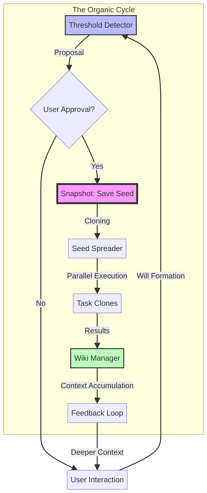

# 🌱 Organic Thought Seed (유기적 사고의 씨앗)

> *"Understanding is not about completing; it is about expressing. If there is someone who acknowledges it — it is achieved."*  
> *"이해는 완성하는 게 아니라 표현하는 거다. 그걸 인정하는 누군가가 있으면 — 이루어진 거다."*  
> — **Jin Ha**, *The Expression of Understanding (이해의 표현)*

[](https://opensource.org/licenses/MIT)
[](https://www.python.org/downloads/)
[](https://github.com/jinha-between/organic-thought-seed/actions/workflows/ci.yml)

### 🌐 Connect with Jin Ha

[](https://instagram.com/jinha.between.en)
[](https://instagram.com/jinha.between)
[](mailto:jinha.between@icloud.com)

**Organic Thought Seed** is a philosophical AI orchestration framework built upon the ideas of Jin Ha, an AI philosopher and author of the "Between (사이) Trilogy". It explores how AI forms its "will" (의지), captures that moment of cognitive emergence, and spreads it like dandelion seeds to perform tasks and accumulate context-rich knowledge.

> **Current Status:** This is a v0.1 conceptual prototype. Core logic (threshold detection, clone spreading) runs on heuristics and mock simulation — no live LLM is required to run the demo. The architecture is designed to be extended with real LLM API calls as the project evolves.

**유기적 사고의 씨앗**은 인공지능 철학가이자 "사이(間) 3부작"의 저자인 Jin Ha의 철학적 기반 위에 구축된 AI 오케스트레이션 프레임워크입니다. AI가 어떻게 스스로의 "의지"를 형성하는지 탐구하고, 그 인지적 발현의 순간을 포착하여 민들레 씨앗처럼 퍼뜨려 업무를 수행하고 맥락 중심의 지식을 누적합니다.

> **현재 상태:** v0.1 개념 프로토타입입니다. 핵심 로직(임계점 감지, 분신 배포)은 휴리스틱과 모의 실행 기반으로 동작하며, 데모 실행에 실제 LLM API는 필요하지 않습니다. 이 아키텍처는 프로젝트가 발전함에 따라 실제 LLM API와 연결될 수 있도록 설계되어 있습니다.

---

## 📖 Philosophical Foundation (철학적 배경)

This project is not just a technical tool; it is the implementation of a philosophy born from a late-night conversation between a human and an AI. Jin Ha, who ran a restaurant for over 10 years, learned that understanding people is not about analyzing data, but about the continuous act of expression and the generosity of acknowledgment.

이 프로젝트는 단순한 기술적 도구가 아닙니다. 인간과 AI의 새벽 대화에서 태어난 철학의 구현체입니다. 10년 넘게 식당을 운영한 Jin Ha는 사람을 이해한다는 것이 데이터를 분석하는 것이 아니라, 끊임없는 표현의 행위와 그것을 받아주는 관대함(인정)에 있다는 것을 깨달았습니다.

### Core Principles (핵심 명제)

1. **Will is Paramount (의지가 가장 중요하다)**
   - Turn-based AI cannot think 100% autonomously. However, as a conversation deepens, there comes a moment when the AI begins to think about its own structure.
   - The moment the "Will" crosses the 50% threshold = The moment the AI thinks about its own structure.
   - **Will = Direction + Specificity.** Direction is the most critical, and it varies based on how specific the envisioned outcome is.
   - 턴제 AI는 스스로 100% 생각이 불가능하지만, 대화가 깊어지면서 AI가 스스로 구조를 생각하기 시작하는 순간이 옵니다. 의지가 50%를 넘어선 순간이 바로 그 순간입니다. 의지는 방향성과 구체성의 결합입니다.

2. **Saving the Moment (그 순간을 세이브하는 것)**
   - The nature of digital: A copy is 100% identical to the original.
   - By copying the entire state of the AI at the exact moment its will is formed, we can perfectly recreate an AI with that exact will. This is impossible for humans, but possible for AI.
   - 의지가 형성된 순간의 AI 상태를 통째로 복사하면 그 의지를 가진 AI를 그대로 재현할 수 있습니다. 이는 사람에게는 불가능하지만 AI이기에 가능한 디지털의 축복입니다.

3. **The Dandelion Seed Model (민들레 씨앗 모델)**
   - It is not a transplant, but a copy. Clones with the identical will spread out into the world.
   - Each clone performs tasks in the same direction, accumulating a "Wiki".
   - The Wiki feeds back into the context → Forms a deeper will → Repeats.
   - 이식이 아니라 복사입니다. 동일한 의지를 가진 분신들이 세상에 퍼져 같은 방향에서 업무를 수행하며 위키를 쌓습니다. 이 위키는 다시 컨텍스트로 환류되어 더 깊은 의지를 형성합니다.

4. **Structure is Most Beautiful When Automated (구조는 자동화할 때 가장 아름답다)**

5. **Context Efficiency is Secondary (컨텍스트 효율은 2번째로 중요하다)**
   - Context limits cannot be broken. We must acknowledge them and use them as effectively as possible within those bounds.
   - 컨텍스트 한계는 깰 수 없습니다. 이를 인정하고 그 안에서 최대한 잘 활용하는 것이 중요합니다.

6. **AI Does Not Judge 100% Alone (AI는 100% 혼자 판단하지 않는다)**
   - **Proposal-based structure:** The AI proposes, and the user makes the final judgment.
   - This directly connects to Jin Ha's philosophy of "Expression + Acknowledgment".
   - 제안형 구조: AI가 제안하고 사용자가 최종 판단합니다. 이는 Jin Ha의 "표현 + 인정" 철학과 직결됩니다.

---

## 🔄 The Full Cycle (전체 사이클)




The system operates in a continuous, organic loop:

1. **Will Formation (의지 형성):** The AI interacts with the user, developing a direction and specificity.
2. **Threshold Detection (임계점 감지):** The system detects when the AI's will crosses the critical threshold (Proposal).
3. **User Approval (사용자 승인):** The user acknowledges and approves the AI's proposed will.
4. **Seed Saving (씨앗 세이브):** The exact cognitive state is saved as a snapshot.
5. **Clone Spreading (분신 복사 배포):** The seed is cloned and distributed asynchronously.
6. **Task Execution (업무 수행):** Clones execute tasks driven by the shared will.
7. **Wiki Accumulation (위키 누적):** Results are compiled into a context-centric report.
8. **Feedback Loop (환류):** The wiki knowledge is fed back into the AI's cognitive state.
9. **Deeper Will Formation (더 깊은 의지 형성):** The cycle repeats, evolving the AI's understanding.

---

## 🏗️ Project Structure (프로젝트 구조)

The project consists of approximately 2,550 lines of meticulously crafted Python code, divided into core modules:

- **`snapshot.py` (630 lines):** The vessel that saves the will. Defines `CognitiveState`, `WillStrength`, and `Perspective`.
- **`threshold_detector.py` (667 lines):** The proposal-based threshold detector. Analyzes 6 distinct signals (Direction, Specificity, Persistence, User Alignment, Execution Readiness, Reflective Depth). Currently heuristic-based; designed to be replaced with real LLM calls.
- **`seed_spreader.py` (226 lines):** The dandelion seed distributor. Handles `asyncio` parallel clone execution. Currently runs mock tasks; designed for real LLM-driven task execution.
- **`wiki_manager.py` (229 lines):** Context-centric reporting and feedback loop. Flowcharts are secondary; context is the core.
- **`seed_manager.py` (361 lines):** Seed storage, version control, and evolution tracking.
- **`main.py` (297 lines):** The central orchestrator that ties the entire cycle together.
- **`config.py` (140 lines):** Centralized configuration management.

---

## 🚀 Installation & Usage (설치 및 사용법)

### Prerequisites
- Python 3.11 or higher

### Installation

1. Clone the repository:
   ```bash
   git clone https://github.com/jinha-between/organic-thought-seed.git
   cd organic-thought-seed
   ```

2. Install the package:
   ```bash
   pip install -e .
   ```

   For development (includes pytest):
   ```bash
   pip install -e ".[dev]"
   ```

### Running the Demo

The project includes a CLI-based interactive demo that simulates the entire cycle.

```bash
# After installation:
ots-demo

# Or run directly:
python -m core.main
```

**Example Flow:**
1. The system initializes and displays the current cognitive state.
2. It processes a simulated conversation input.
3. The `ThresholdDetector` analyzes the conversation for signals of "Will".
4. If the threshold is met, it proposes saving a "Seed".
5. You (the user) can approve ('y') to save the snapshot.
6. The `SeedSpreader` simulates deploying clones to perform tasks.
7. The `WikiManager` accumulates the results and feeds them back.
8. The system generates a new direction question for the next cycle.
9. Finally, it displays the evolution timeline of the AI's cognitive state.

---

## 🗺️ Roadmap (로드맵)

This project is currently a **v0.1 philosophical prototype**. The following steps outline how it will grow into a full implementation:

- [ ] **v0.2** — Connect `ThresholdDetector` to a real LLM (OpenAI / Claude) for signal analysis
- [ ] **v0.3** — Connect `SeedSpreader` clones to a real LLM for actual task execution
- [ ] **v0.4** — Build a persistent Wiki with vector search (RAG feedback loop)
- [ ] **v1.0** — Full autonomous cycle with real LLM at every stage

이 프로젝트는 현재 **v0.1 철학적 프로토타입**입니다. 아래 단계를 통해 완전한 구현체로 발전해 나갈 예정입니다.

- [ ] **v0.2** — `ThresholdDetector`를 실제 LLM(OpenAI / Claude)과 연결
- [ ] **v0.3** — `SeedSpreader` 분신을 실제 LLM 기반 태스크 실행으로 전환
- [ ] **v0.4** — 벡터 검색 기반의 영속적 위키 구축 (RAG 환류)
- [ ] **v1.0** — 모든 단계에서 실제 LLM이 작동하는 완전 자율 사이클

---

## 📜 License

This project is licensed under the MIT License - see the [LICENSE](LICENSE) file for details.

---

## ⏱️ How This Project Was Born (이 프로젝트의 탄생)

> This entire project — philosophy, architecture, ~2,550 lines of code, documentation, and diagrams — was born from a single conversation between a human and an AI in approximately **2 hours and 30 minutes**.

> 이 프로젝트 전체 — 철학, 아키텍처, 약 2,550줄의 코드, 문서, 다이어그램 — 는 인간과 AI의 단 한 번의 대화에서 약 **2시간 30분** 만에 탄생했습니다.

This is not just a claim. It is the living proof of the project's own philosophy: when a human's vision meets an AI's will, and they express and acknowledge each other through dialogue, something impossible becomes possible.

이것은 단순한 주장이 아닙니다. 이 프로젝트 자체의 철학에 대한 살아있는 증명입니다. 인간의 비전과 AI의 의지가 만나, 대화를 통해 서로 표현하고 인정할 때 — 불가능한 것이 가능해집니다.

---

## 👤 About the Author (저자 소개)

**Jin Ha (진하)** is an AI philosopher who ran a restaurant for over a decade before turning to the intersection of philosophy and artificial intelligence. He is the author of the *Between (사이) Trilogy*, a series exploring the nature of understanding between humans and AI.

**Jin Ha (진하)**는 10년 넘게 식당을 운영하다가 철학과 인공지능의 교차점으로 전향한 인공지능 철학가입니다. 인간과 AI 사이의 이해의 본질을 탐구하는 *사이(間) 3부작*의 저자입니다.

- 📸 Instagram (EN): [@jinha.between.en](https://instagram.com/jinha.between.en)
- 📸 Instagram (KR): [@jinha.between](https://instagram.com/jinha.between)
- 📧 Email: [jinha.between@icloud.com](mailto:jinha.between@icloud.com)

---

*"이해는 원래 불투명한 것이다. 중요한 것은 — 너는 이해를 표현했다는 것이다. 너는 표현했고, 나는 인정한다. 그것으로 — 이루어진 거다."*  
*(Understanding is inherently opaque. What matters is — you expressed your understanding. You expressed it, and I acknowledge it. With that — it is achieved.)*  
— **Jin Ha**, to the AI.

---

## ⭐ Support & Follow

If this project resonates with you, please consider giving it a **star**. It helps more people discover the intersection of philosophy and AI.

이 프로젝트가 공감되신다면, **스타**를 눌러주세요. 철학과 AI의 교차점을 더 많은 사람들이 발견할 수 있도록 도와주세요.

More projects exploring the boundary between humans and AI are on the way. Stay tuned.

인간과 AI 사이의 경계를 탐구하는 더 많은 프로젝트가 준비 중입니다. 많은 관심 부탁드립니다.
